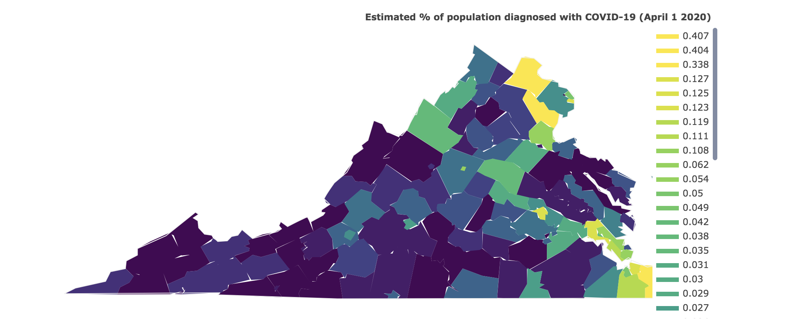

## COVID-19 VA Analysis
Saving this as a working draft of an exploratory analysis of the VA department 
of health public use dataset for COVID-19.

# Running the notebook
Install Python3 and Jupyter lab 

``` 
jupyter lab
```

To develop and run visualizations locally, please follow the instructions described in the notebook 
 `graphing-va-counties.ipynb`
 
You will need to update the path for the csv so pandas can read it.



# Next steps
* Get more data
* Spend more time exploring

# Sources
* COVID data pulled from the [Virginia Department of Health](http://www.vdh.virginia.gov/coronavirus/)
* Population data and estimates pulled from [UVA's Weldon Cooper Center](https://demographics.coopercenter.org/virginia-population-estimates/)  


